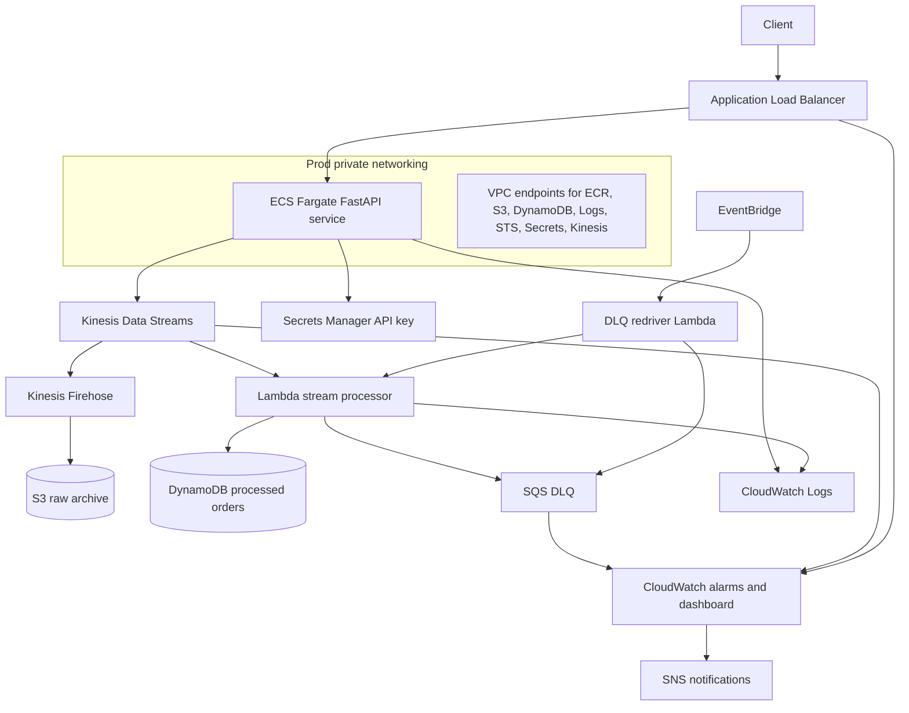

# CDK Orders Platform Architecture

## Key Flow

1. ALB receives HTTP traffic and forwards it to ECS Fargate.
2. FastAPI validates the API key and publishes order events to Kinesis.
3. Lambda consumes stream records and writes processed state to DynamoDB.
4. Firehose archives raw events to S3.
5. Failed stream batches are routed to SQS DLQ.
6. EventBridge triggers remediation and incident-response workflows.
