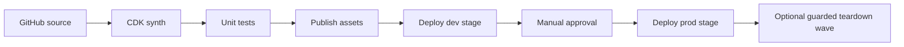

# Pipeline Architecture

## SAM Pipeline

```mermaid
flowchart LR
    Source[GitHub source] --> Build[CodeBuild]
    Build --> Validate[sam validate --lint]
    Validate --> Tests[Unit tests]
    Tests --> Package[sam build/package]
    Package --> Dev[CloudFormation deploy dev]
    Dev --> Approval[Manual approval]
    Approval --> Prod[CloudFormation deploy prod]
    Prod --> Canary[Lambda canary deployments]
    Canary --> Alarms[CloudWatch rollback alarms]
```

## CDK Pipeline

## Portfolio Signal

Both pipelines demonstrate the same operational idea with different tooling:

- Build once.
- Validate before deploy.
- Promote through dev first.
- Require human approval before prod.
- Use automated rollback or explicit guardrails for risky changes.
