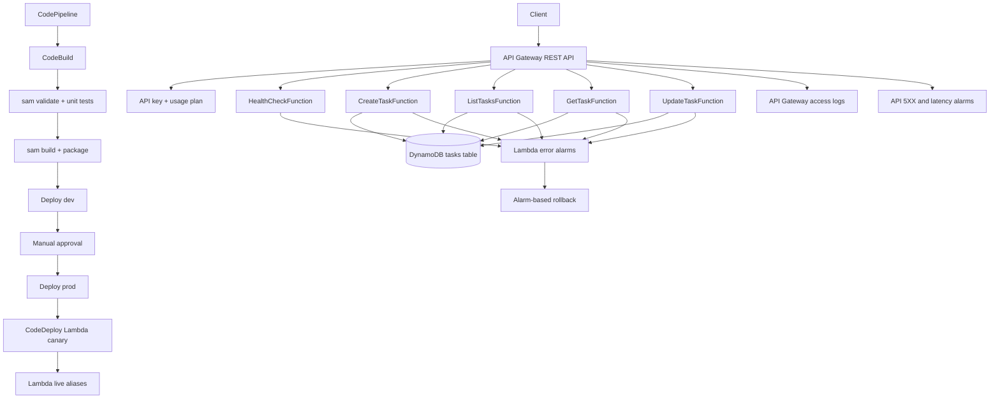

# SAM Task API Architecture

## Key Flow

1. Clients call API Gateway with an API key.
2. API Gateway routes each operation to a dedicated Lambda function.
3. Lambda functions read/write the DynamoDB task table.
4. SAM publishes function versions behind `live` aliases.
5. CodeDeploy shifts traffic with `Canary10Percent5Minutes`.
6. CloudWatch alarms provide deployment rollback signals.
